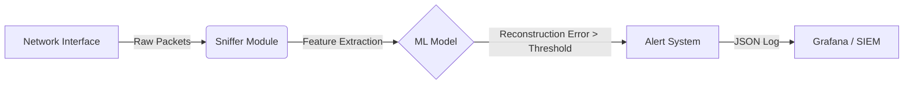

# 👁️ ARGUS (Advanced Reconnaissance & Guardian Utility System)
> *The All-Seeing Network Eye. An Enterprise-Grade Anomaly Detection System.*


**Argus** is a Next-Gen **Network Detection & Response (NDR)** tool designed to catch "Unknown Unknowns" (Zero-Day Exploits) using Unsupervised Deep Learning. unlike traditional tools that rely on signatures, Argus learns what "Normal" looks like and flags anything that deviates.

## 🚀 Features

-   **Deep Packet Inspection (DPI)**: Uses `Scapy` to extract granular features (Packet Size, TCP Flags, Protocol, Ports).
-   **Unsupervised Learning**: Implements a TensorFlow Autoencoder to detect unknown threats without labeled data.
-   **Real-Time Detection**: Stream-based processing architecture for live monitoring.
-   **Enterprise Logging**: Structured JSON logging ready for SIEM integration (Splunk/ELK).
-   **Dockerized**: Fully containerized for easy deployment.

## 🏗️ Architecture

The system follows a modular pipeline architecture:



-   **`sniffer.py`**: Captures traffic asynchronously.
-   **`features.py`**: ETL pipeline converting raw bytes to normalized vectors.
-   **`autoencoder.py`**: Neural network that compresses and reconstructs input. High reconstruction error indicates an anomaly.

## 🛠️ Installation
## 🧠 How the AI Works (The "Secret Sauce")

Traditional firewalls use **Signatures** (like a fingerprint database) to stop known attacks.
**Project Alpha uses Deep Learning (Autoencoders) to find UNKNOWN attacks (Zero-Days).**

### The Concept: "Normalcy"
1.  **Training**: The AI watches your normal network traffic (Netflix, YouTube, Spotify) and learns to "reconstruct" it.
    -   *Input*: A packet (Size=500, Port=443) -> *AI* -> *Output*: Same packet.
    -   Error: **Low**.

2.  **Detection**: When a hacker attacks, the packet looks different (Size=9999, Port=1337, Weird Flags).
    -   The AI has never seen this. It fails to reconstruct it properly.
    -   *Input*: Attack Packet -> *AI* -> *Output*: Garbled mess.
    -   Error: **HIGH (Anomaly!)**.

### The Tech Stack
-   **TensorFlow/Keras**: Builds the Neural Network.
-   **Autoencoder Architecture**: Compresses data into a tiny "bottleneck" layer, forcing it to learn only the most important patterns of normal traffic.
-   **Thresholding**: We establish a dynamic "Risk Score". If `Reconstruction Error > Threshold`, it gets flagged.

## 🚀 Usage

### Option A: Docker (Recommended)

1.  **Build the Image**:
    ```bash
    docker build -t project-alpha .
    ```

2.  **Run Training (Baseline)**:
    ```bash
    docker run --net=host -v $(pwd)/logs:/app/logs project-alpha --train
    ```

3.  **Run Detection**:
    ```bash
    docker run --net=host -v $(pwd)/logs:/app/logs project-alpha --detect
    ```

### Option B: Local Python

1.  Install dependencies (Requires Npcap on Windows):
    ```bash
    pip install -r requirements.txt
    ```

2.  Run Training:
    ```bash
    python -m project_alpha.main --interface "Wi-Fi" --train
    ```

3.  Run Detection:
    ```bash
    python -m project_alpha.main --interface "Wi-Fi" --detect
    ```

### Option C: Linux / Kali (Auto-Installer) 🐧

1.  **Clone & Install**:
    ```bash
    git clone https://github.com/Start-Of-The-Week/ARGUS.git
    cd ARGUS
    chmod +x install.sh
    ./install.sh
    ```
    *(This script installs `libpcap`, creates a python venv, and sets raw socket permissions)*.

2.  **Run Argus**:
    ```bash
    # Training (Learns "Normal" behavior)
    sudo ./venv/bin/python3 project_alpha/main.py --train

    # Detection (Finds Anomalies)
    sudo ./venv/bin/python3 project_alpha/main.py --detect

    # Dashboard (Visualizes Threats)
    ./run_dashboard.bat  # Windows
    # OR
    sudo ./venv/bin/streamlit run dashboard.py # Linux

    # Generate PDF Report
    sudo ./venv/bin/python3 -m project_alpha.src.reporting
    ```

### Troubleshooting
- **No Packets Detected?**: If you see "Watching..." but no packet counts, try generating traffic (open a web page) or check if you are using the correct interface (use `--list-interfaces`).
- **Dashboard Empty?**: Run `python3 populate_db.py` to generate sample data if you haven't detected any real anomalies yet.

## 🛡️ Value in a SOC / Defensive Role
How does Project Alpha help a Security Operations Center (SOC)?

1.  **Zero-Day Detection (The "Unknown Unknowns")**:
    -   Traditional Firewalls/IDS rely on signatures (knowing the attack beforehand).
    -   **Project Alpha** learns "Normal" behavior. If a hacker uses a brand new exploit, the traffic pattern will look "Abnormal" and trigger an alert.
    -   *Use Case*: Detecting a new Ransomware variant before antivirus vendors release a signature.

2.  **Insider Threat / Data Exfiltration**:
    -   A rogue employee uploading gigabytes of data to a personal server might use normal protocols (HTTPS), but the **Volume** and **Entropy** will be anomalous.
    -   *Use Case*: Stopping IP theft.

3.  **C2 Beaconing (Command & Control)**:
    -   Malware often "phones home" at regular intervals. These small, repetitive packets stand out against random user browsing.
    -   *Use Case*: Identifying infected hosts that are part of a botnet.

4.  **Forensic Baseline**:
    -   The `forensics.db` allows analysts to replay historical traffic to see *when* an anomaly started.

---
## 🤝 Contributing

## 📊 Configuration

Edit `config.yaml` to tune hyperparameters:

```yaml
network:
  interface: "eth0"
  train_packet_count: 5000

model:
  epochs: 20
  batch_size: 32
```

### 3. Web Dashboard (Live Monitoring)
To visualize threats in real-time::

```bash
streamlit run dashboard.py
```

This will launch a browser window showing:
- Real-time Anomaly Score graph
- Threat Severity Distribution
- Recent Alerts Log

## 📈 Visualization

The tool outputs `anomalies.json`. To visualize in Grafana:
1.  Use Loki or Filebeat to ingest `anomalies.json`.
2.  Create a Time Series panel filtering for `score > threshold`.

---
**Author**: Sri Charan Pedhiti
**License**: MIT
